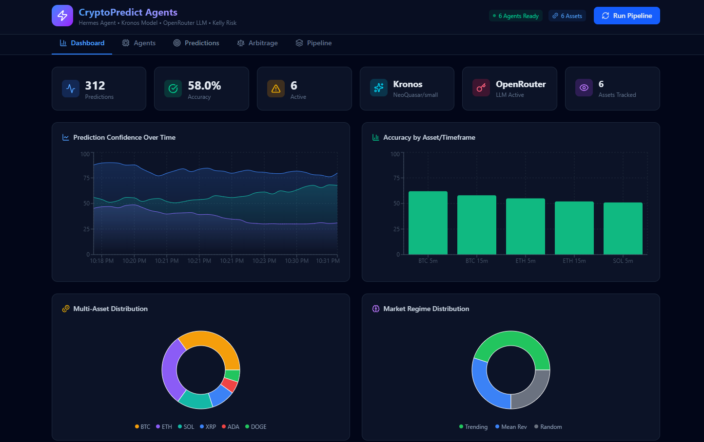
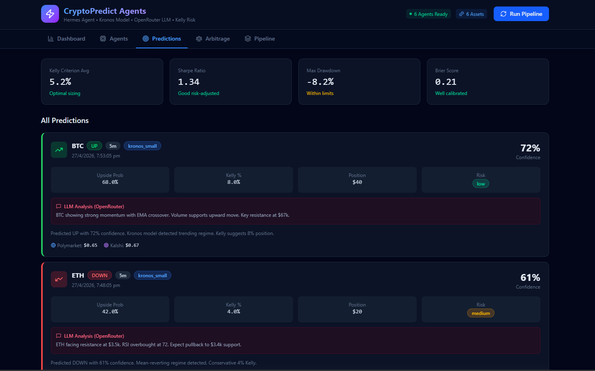
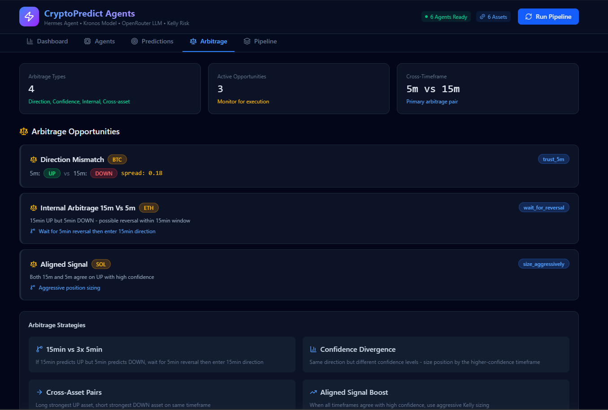
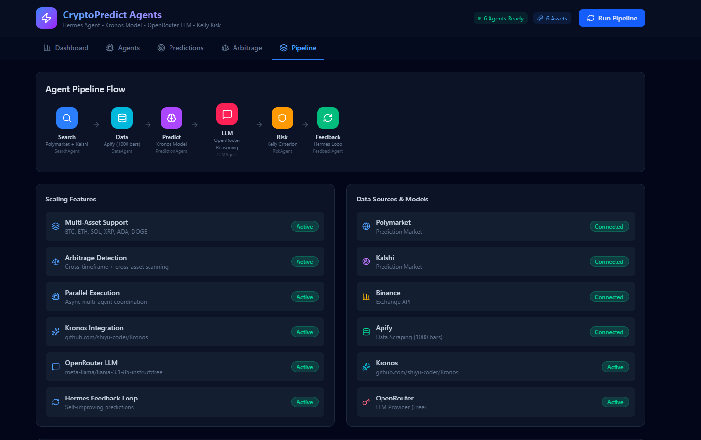

# CryptoPredict Agents

> Multi-agent AI system for short-term crypto price prediction via Polymarket & Kalshi markets.  
> **Stack:** FastAPI · Kronos Foundation Model · OpenRouter LLM · Apify · React + Vite

---

## Demo

<!-- 🎬 DEMO VIDEO
     Replace the block below with your screen recording.
     Recommended: MP4 / GIF, 60–90 seconds, showing a full prediction cycle.
     GitHub supports videos up to 10MB inline; larger files → use a YouTube/Loom link.

     Option A – Hosted video (YouTube / Loom):
     [](https://youtu.be/YOUR_VIDEO_ID)

     Option B – Raw file in repo (≤ 10MB):
     https://github.com/YOUR_USERNAME/crypto-predict-agents/assets/YOUR_ASSET_ID/demo.mp4
-->


https://github.com/user-attachments/assets/ad3e593f-f5c0-4ca6-b641-186eb9a79feb

 

---

## Screenshots

<!-- Replace each placeholder path with your actual screenshot file.
     Suggested shots:
       1. Dashboard overview (live confidence charts + stats cards)
       2. Predictions tab (prediction cards with LLM analysis & Kelly sizing)
       3. Arbitrage tab (active opportunities)
       4. Pipeline tab (agent flow visualization)
     Place files in docs/images/ and update paths below. -->

| Dashboard | Predictions |
|-----------|-------------|
|  |  |

| Arbitrage | Pipeline |
|-----------|----------|
|  |  |

> 📸 **Add your screenshots:** Create a `docs/images/` folder and drop in your PNGs, then the table above will render automatically on GitHub.

---

## What It Does

Runs a 6-agent pipeline every cycle to generate **5-minute and 15-minute UP/DOWN predictions** for BTC, ETH, SOL, XRP, ADA, and DOGE — then surfaces arbitrage opportunities across timeframes and assets.

```
Polymarket + Kalshi  →  Search Agent
Apify / Binance      →  Data Agent    →  Prediction Agent (Kronos)  →  Risk Agent (Kelly)
                                                                              ↓
                         Feedback Agent  ←────────────────────────  LLM Agent (OpenRouter)
```

---

## The 6 Agents

| # | Agent | Role |
|---|-------|------|
| 1 | **Search Agent** | Scans Polymarket & Kalshi for active BTC/ETH 5m/15m prediction markets |
| 2 | **Data Agent** | Fetches last 1000 OHLCV bars via Apify → Binance fallback |
| 3 | **Prediction Agent** | Runs [Kronos-small](https://github.com/shiyu-coder/Kronos) (24.7M params) with 30× Monte Carlo sampling |
| 4 | **LLM Agent** | Market reasoning via OpenRouter (Llama 3.1 8B, free tier) |
| 5 | **Risk Agent** | Kelly Criterion position sizing + drawdown control |
| 6 | **Feedback Agent** | Tracks Brier score & calibration, updates ensemble weights |

---

## Scaling Features

**Multi-asset** — 6 assets tracked in parallel across two timeframes = 12 predictions per cycle.

**Internal Arbitrage** — Detects when the 15-minute prediction contradicts the next three 5-minute predictions. Example:

```
15m → UP   but   5m × 3 → DOWN
Strategy: Wait for 5m reversal, enter in 15m direction
```

**Arbitrage types detected:**

| Type | Description |
|------|-------------|
| Direction Mismatch | 5m and 15m point opposite ways |
| Confidence Divergence | Same direction, different confidence |
| Cross-Asset | Some assets UP, others DOWN → pairs trade |
| Aligned Signal | All timeframes agree → aggressive Kelly sizing |

---

## Quick Start

**Prerequisites:** Python 3.11+, Node.js 20+

### Backend

```bash
cd backend
pip install -r requirements.txt
python main.py
# → http://localhost:8000
# → http://localhost:8000/docs  (Swagger UI)
```

### Frontend

```bash
# from project root
npm install
npm run dev
# → http://localhost:5173
```

### Environment

`backend/.env` is pre-configured with:
```env
APIFY_API_TOKEN=<your key>
OPENROUTER_API_KEY=<your key>
```

Optional (for live trading):
```env
KALSHI_API_KEY_ID=
POLYMARKET_KEY_ID=
```

---

## API Reference

```bash
POST /api/predict              # Single asset prediction
POST /api/predict/multi-asset  # All assets, all timeframes
POST /api/market-data          # Fetch OHLCV bars
POST /api/arbitrage            # Check arbitrage opportunities
POST /api/llm/reasoning        # LLM market analysis

GET  /api/status               # System health + agent metrics
GET  /api/feedback             # Learning loop stats
GET  /api/kronos/info          # Model info
```

Example response:

```json
{
  "asset": "BTC",
  "timeframe": "5m",
  "prediction": "up",
  "confidence": 0.72,
  "kelly_fraction": 0.08,
  "recommended_position": 40.00,
  "polymarket_price": 0.65,
  "model_used": "kronos_small",
  "regime": "trending",
  "pipeline_latency_ms": 2450
}
```

---

## Project Structure

```
crypto/
├── backend/
│   ├── main.py                  # FastAPI server
│   ├── config.yaml              # Assets, model, risk config
│   ├── .env                     # API keys
│   ├── requirements.txt
│   ├── kronos_integration.py    # Kronos model wrapper
│   ├── agents/
│   │   ├── base_agent.py        # Hermes-pattern base class
│   │   ├── search_agent.py
│   │   ├── data_agent.py
│   │   ├── prediction_agent.py
│   │   ├── llm_agent.py
│   │   ├── risk_agent.py
│   │   ├── feedback_agent.py
│   │   └── orchestrator.py
│   ├── tools/                   # Polymarket, Kalshi, Kronos, Kelly tools
│   └── utils/                   # Logging, config loader, helpers
└── src/                         # React dashboard (5 tabs)
    └── App.tsx                  # Dashboard / Agents / Predictions / Arbitrage / Pipeline
```

---

## Dashboard

Five-tab React dashboard at `localhost:5173`:

- **Dashboard** — Live confidence charts, accuracy by asset
- **Agents** — Status, tool registry, memory, metrics
- **Predictions** — All predictions with LLM analysis & Kelly sizing
- **Arbitrage** — Active opportunities and strategy breakdowns
- **Pipeline** — Visual agent flow and data source map

---

## Kronos Model

[Kronos](https://github.com/shiyu-coder/Kronos) is the first open-source foundation model for financial candlestick data, trained on 45+ global exchanges.

| Model | Params | Context | HuggingFace |
|-------|--------|---------|-------------|
| Kronos-mini | 4.1M | 2048 | `NeoQuasar/Kronos-mini` |
| **Kronos-small** ← used | **24.7M** | **512** | **`NeoQuasar/Kronos-small`** |
| Kronos-base | 102.3M | 512 | `NeoQuasar/Kronos-base` |

Falls back to a statistical ensemble (SMA crossover + RSI momentum + regime detection) when the model is unavailable.

---

## Disclaimer

Educational and research purposes only. Not financial advice. Probabilistic forecasts, not guarantees.

**MIT License**
